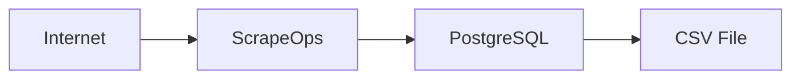

### Car data scraper using scrapeops

### Diagram Structure

- **Internet**: Initiates the process, connecting to ScrapeOps.
- **ScrapeOps**: Handles data extraction and sends it directly to PostgreSQL.
- **PostgreSQL**: Stores the data.
- **CSV File**: Final destination for the exported data when pulled.
